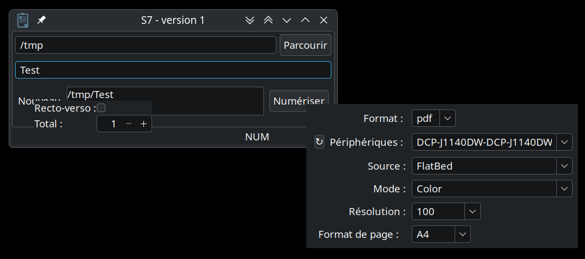

# S7

This is a simple scanning application with these goals:

 - full page scan
 - known number of pages to scan
 - double-sided handling
 - multiple output file format: PNG, JPEG, TIFF, PNM and PDF
 - apply an optional stamp on each page.

It is based on [libinsane](https://gitlab.gnome.org/World/OpenPaperwork/libinsane) and [wxWidgets](https://wxwidgets.org).

### Usage

Inputs:

 - a target directory
 - the basename of the output file(s)
 - the number of faces to scan
 - double-sided or not
 - the scanner and its minimal parameters (source, mode, resolution)
 - page size
 - output file format.
 - an optional stamp text

Right click on the 'New' label to specify the number of faces and whether double-sided scanning is needed.

'Shift + left click' on the 'New' label to update the output path.

Right click on the 'Scan' button to set the device properties.

Outputs:

 - a single PDF file with the number of requested pages
 - multiple PNG files with a padded index as suffix.

### Double-sided scanning

This has meaning if an automatic document feeder (ADF) is used to scan multiple pages on both sides.

Feed in all the pages on the front face, then turn the whole pile of pages even if an odd number of pages is requested and continue scanning.

If only front faces are needed with an ADF, uncheck the 'Double-sided' option.

### Notes

The project targets Linux only using wxGTK3.

When running under Wayland, set the 'GDK_BACKEND=x11' environment variable to avoid unexpected results.

### Disclaimer

Use at your own risks.

